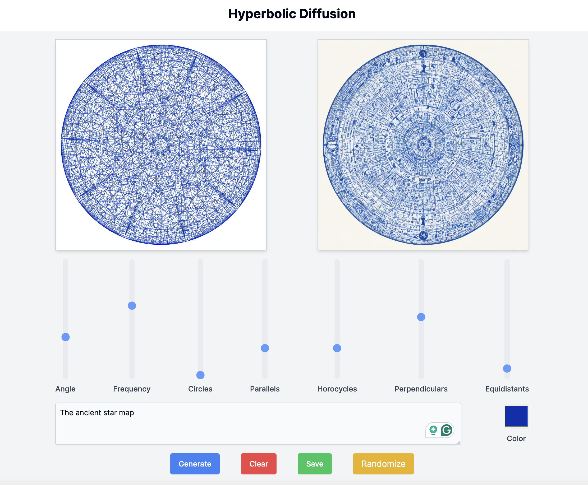
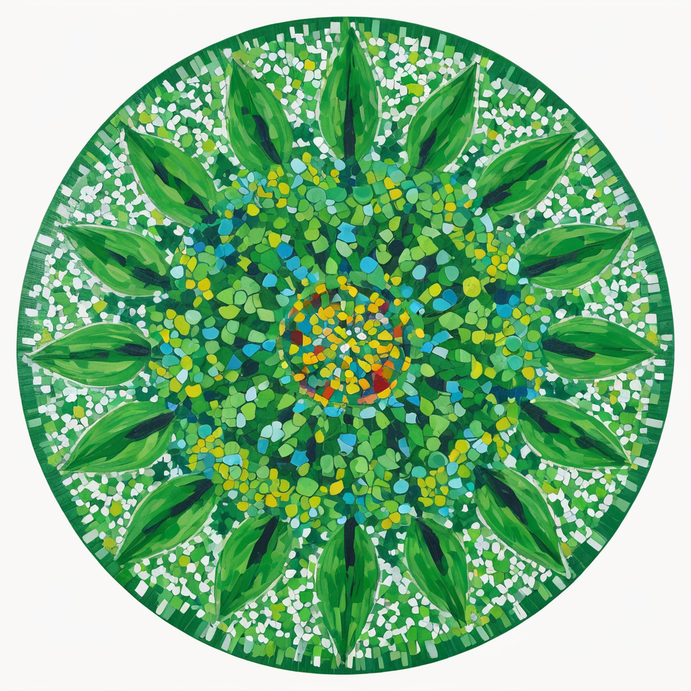
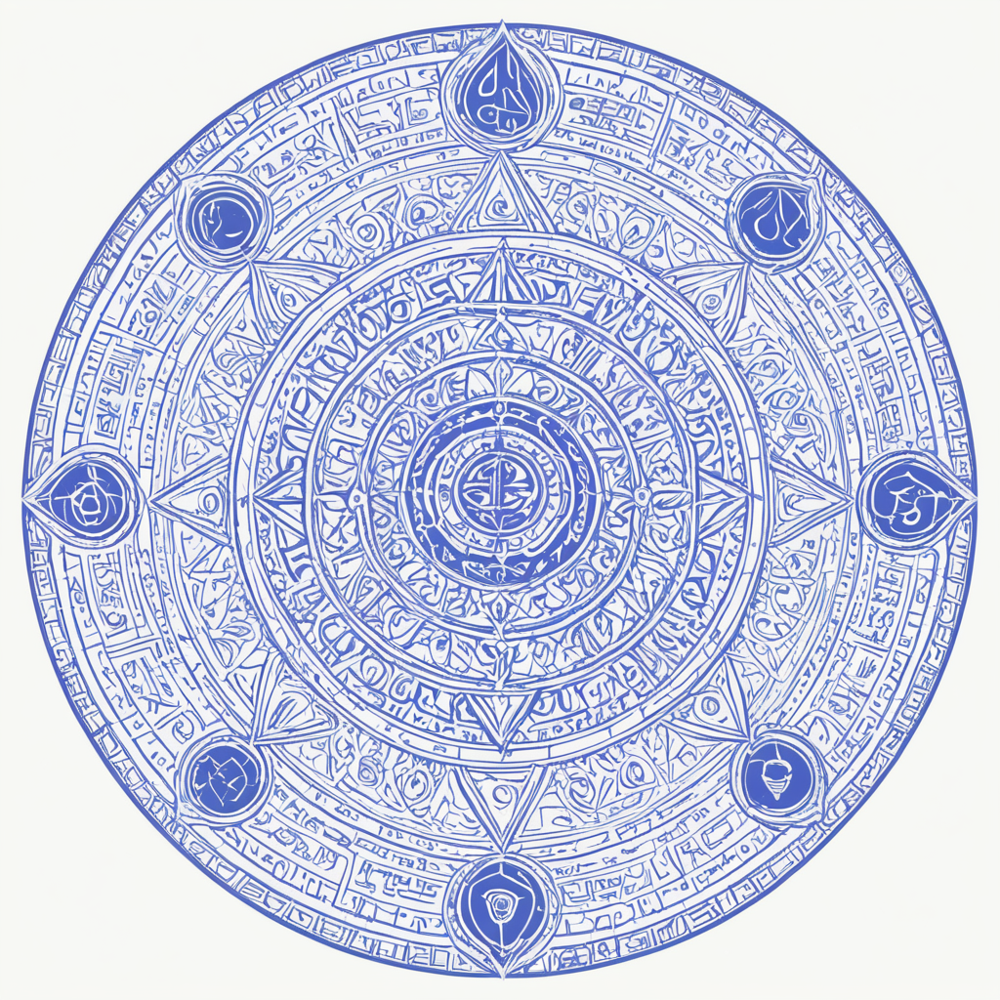
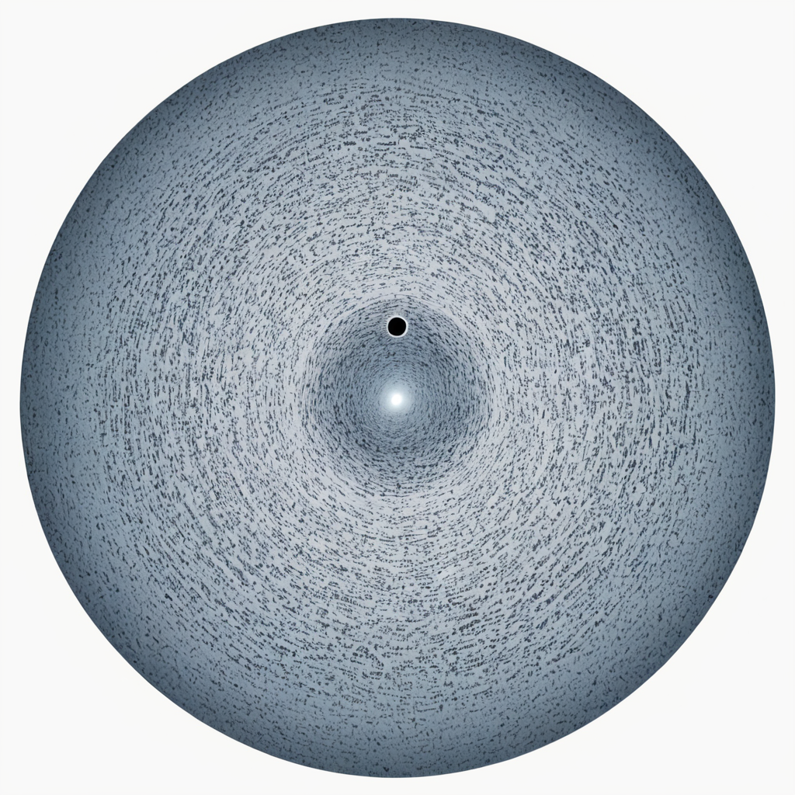
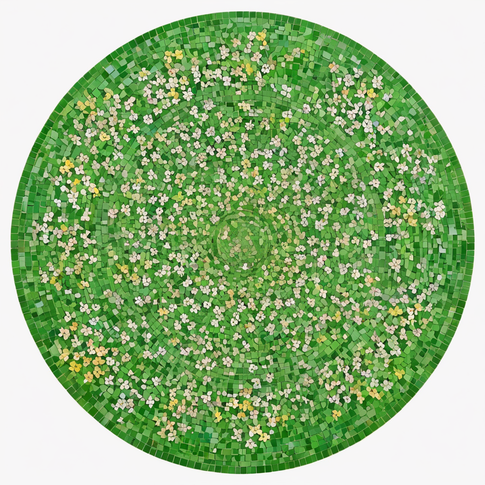
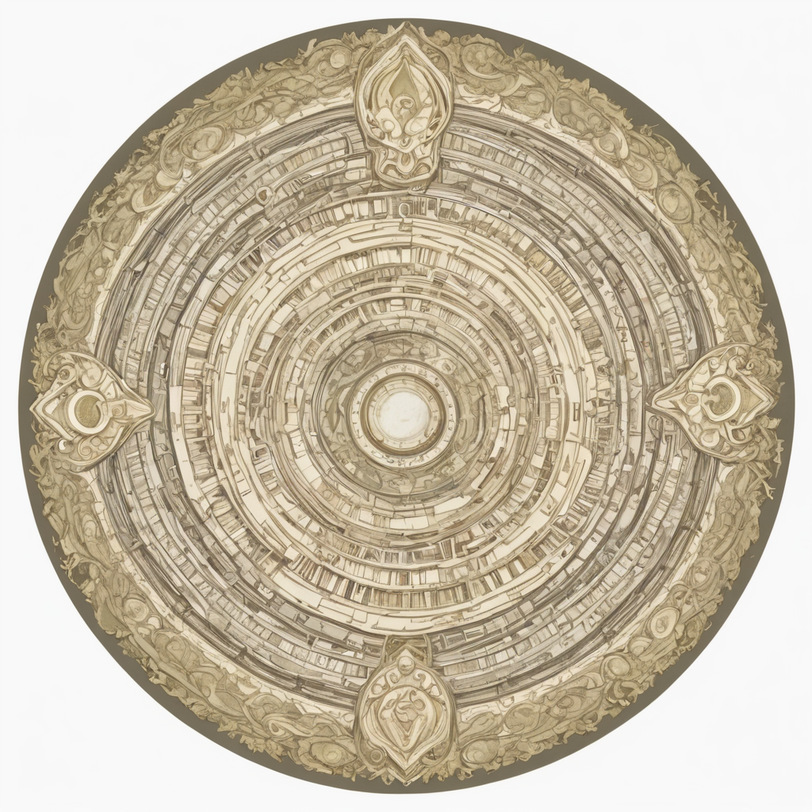

# Hyperbolic Diffusion

Draw complex patterns on the Poincare disk model of the hyperbolic plane and transform them using Stable diffusion.

## Installation

Download and install [ComfyUI](https://github.com/comfyanonymous/ComfyUI). You can do it in one click using [Pinokio](https://github.com/pinokiocomputer/pinokio).

Download [DreamShaper XL - v2.1 Turbo DPM++ SDE](https://civitai.com/models/112902/dreamshaper-xl?modelVersionId=351306) and put it in the folder `checkpoints` of ComfyUI

Clone this repository and either:

1. Install Node.js and `run npm run dev`

2. Or install Docker and Docker-compose and run `docker-compose build` and `docker-compose up -d`

Go to http://localhost:3000/ and enjoy.

## Examples

|                                       |                                       |                                       |
| ------------------------------------- | ------------------------------------- | ------------------------------------- |
|  |  |  |
|  |  |  |